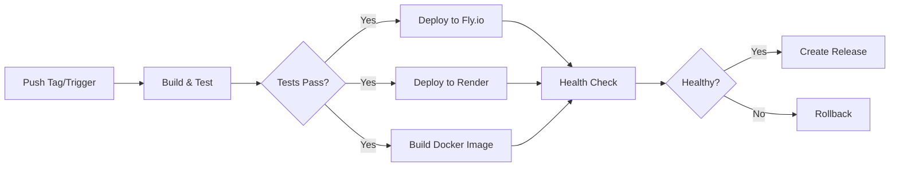

# Deployment Pipeline

A comprehensive deployment pipeline for OpenClaw across multiple platforms.

## Quick Start

### Using GitHub Actions (Recommended)

1. Configure secrets in your GitHub repository:
   - `FLY_API_TOKEN` - For Fly.io deployments
   - `RENDER_API_KEY` and `RENDER_SERVICE_ID` - For Render deployments
   - `GITHUB_TOKEN` - Automatically available, used for Docker registry

2. Trigger deployment:
   - **Automated**: Push a version tag (`git tag v2026.2.4 && git push --tags`)
   - **Manual**: Go to Actions → Deploy → Run workflow

### Using Deployment Scripts

```bash
# Install dependencies
pnpm install

# Deploy to Fly.io production
bash scripts/deploy.sh --platform fly --environment production

# Deploy to all platforms (staging)
bash scripts/deploy.sh --platform all --environment staging

# Dry-run to test configuration
bash scripts/deploy.sh --platform fly --dry-run
```

## Files Created

### GitHub Actions Workflow
- `.github/workflows/deploy.yml` - Automated deployment pipeline with:
  - Pre-deployment validation (build, test, lint)
  - Multi-platform deployment (Fly.io, Render, Docker)
  - Health checks and monitoring
  - Automatic GitHub release creation
  - Rollback support

### Deployment Scripts
- `scripts/deploy.sh` - Manual deployment script with support for:
  - Multiple platforms (Fly.io, Render, Docker)
  - Environment selection (staging, production)
  - Dry-run mode
  - Skip options for tests/build
  
- `scripts/rollback.sh` - Quick rollback to previous versions:
  - Platform-specific rollback procedures
  - Version history management
  - Safety confirmations

### Documentation
- `docs/deployment/README.md` - Comprehensive deployment guide covering:
  - Platform setup and prerequisites
  - Environment configuration
  - Deployment procedures
  - Rollback strategies
  - Troubleshooting
  - Best practices

### Configuration Templates
- `.env.deployment.example` - Complete environment variable template with:
  - Platform-specific credentials
  - Gateway configuration
  - AI provider settings
  - Storage configuration
  - Security settings

## Supported Platforms

### 1. Fly.io (Recommended for Production)
- Persistent storage with mounted volumes
- Automatic SSL certificates
- Global CDN and edge computing
- Simple scaling

**Setup:**
```bash
# Install flyctl
curl -L https://fly.io/install.sh | sh

# Login and get token
flyctl auth login
flyctl auth token
```

### 2. Render
- Zero-config deployments
- Automatic SSL and DDoS protection
- Built-in database and storage
- Free tier available

**Setup:**
1. Create account at https://render.com
2. Get API key from account settings
3. Create service using `render.yaml`

### 3. Docker / Container Platforms
- Works with any Docker-compatible platform
- Supports Docker Compose for local dev
- Multi-architecture support (amd64, arm64)
- GitHub Container Registry integration

**Setup:**
```bash
# Build and run locally
docker build -t openclaw:latest .
docker run -p 18789:18789 openclaw:latest

# Or use Docker Compose
docker-compose up -d
```

## Deployment Workflow

### Automated (CI/CD)



### Manual

```bash
# 1. Test locally
pnpm build && pnpm test

# 2. Deploy with dry-run
bash scripts/deploy.sh --platform fly --dry-run

# 3. Deploy to staging
bash scripts/deploy.sh --platform fly --environment staging

# 4. Verify staging
curl https://openclaw-staging.fly.dev/health

# 5. Deploy to production
bash scripts/deploy.sh --platform fly --environment production

# 6. Monitor
flyctl logs --app openclaw
```

## Environment Configuration

Copy and configure the environment template:

```bash
cp .env.deployment.example .env.deployment

# Edit and fill in your credentials
nano .env.deployment

# Source before deploying
source .env.deployment
```

### Required Variables

- `OPENCLAW_GATEWAY_TOKEN` - Authentication token
- `FLY_API_TOKEN` or `RENDER_API_KEY` - Platform credentials
- AI provider credentials (at least one):
  - `CLAUDE_AI_SESSION_KEY`
  - `ANTHROPIC_API_KEY`
  - `OPENAI_API_KEY`

## Rollback Procedures

### Quick Rollback

```bash
# Rollback to previous version
bash scripts/rollback.sh --platform fly --version 2026.2.3

# Rollback staging
bash scripts/rollback.sh --environment staging --version 2026.2.2
```

### Platform-Specific

**Fly.io:**
```bash
flyctl releases --app openclaw
flyctl releases rollback VERSION_NUMBER --app openclaw
```

**Render:**
Use the dashboard to redeploy a previous version.

**Docker:**
```bash
docker pull ghcr.io/openclaw/openclaw:2026.2.3
docker tag ghcr.io/openclaw/openclaw:2026.2.3 ghcr.io/openclaw/openclaw:latest
```

## Monitoring & Health Checks

### Built-in Health Endpoint

```bash
curl https://your-app.fly.dev/health
```

### Platform Monitoring

**Fly.io:**
```bash
flyctl status --app openclaw
flyctl logs --app openclaw
flyctl vm status --app openclaw
```

**Render:**
Check dashboard at https://dashboard.render.com

**Docker:**
```bash
docker ps
docker logs openclaw
docker stats openclaw
```

## Best Practices

1. **Always test in staging first**
2. **Use semantic versioning** (`v2026.2.4`)
3. **Keep secrets secure** (never commit)
4. **Monitor logs** after deployment
5. **Have rollback plan ready**
6. **Document changes** in CHANGELOG.md
7. **Run health checks** after deployment
8. **Use dry-run** for validation
9. **Automate via CI/CD** when possible
10. **Keep environment vars updated**

## Troubleshooting

### Build Failures
```bash
# Clean and rebuild
rm -rf dist node_modules
pnpm install --frozen-lockfile
pnpm build
```

### Connection Issues
- Check `OPENCLAW_GATEWAY_BIND` setting
- Verify firewall/security rules
- Ensure token is set correctly

### Memory Issues
```bash
# Increase Node.js memory
export NODE_OPTIONS="--max-old-space-size=2048"
```

### Auth Errors
- Verify session keys are current
- Check environment variables
- Refresh expired credentials

## Next Steps

- Review [Deployment Guide](docs/deployment/README.md) for detailed instructions
- Check [Release Checklist](docs/reference/RELEASING.md) before releases
- Set up monitoring and alerting
- Configure backup strategies
- Plan disaster recovery procedures

## Support

- Documentation: `docs/deployment/`
- Issues: https://github.com/openclaw/openclaw/issues
- Logs: Check platform-specific logging
